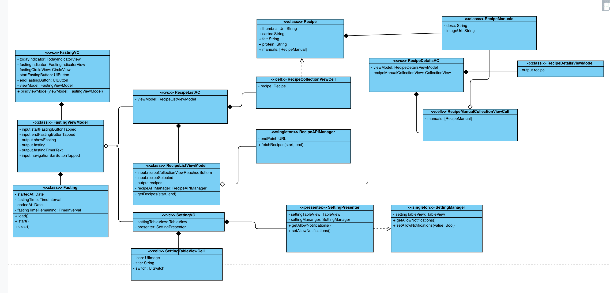
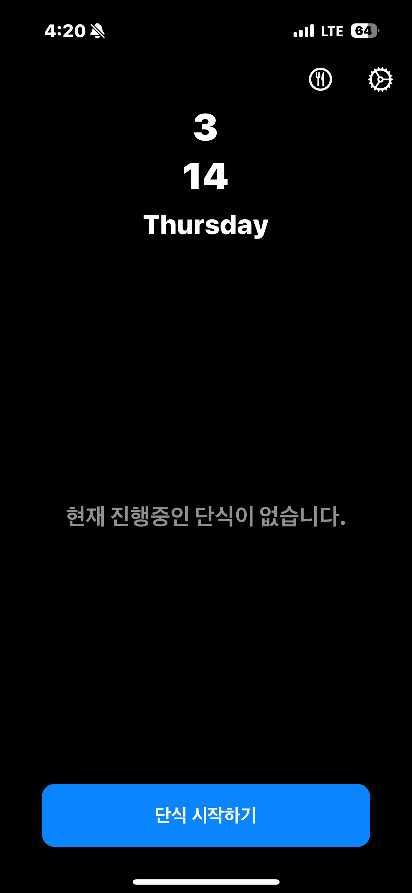
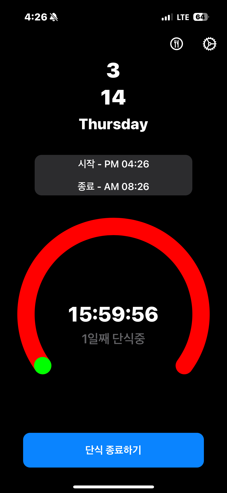
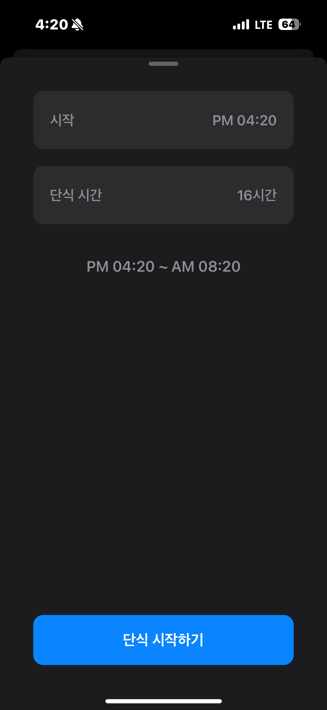
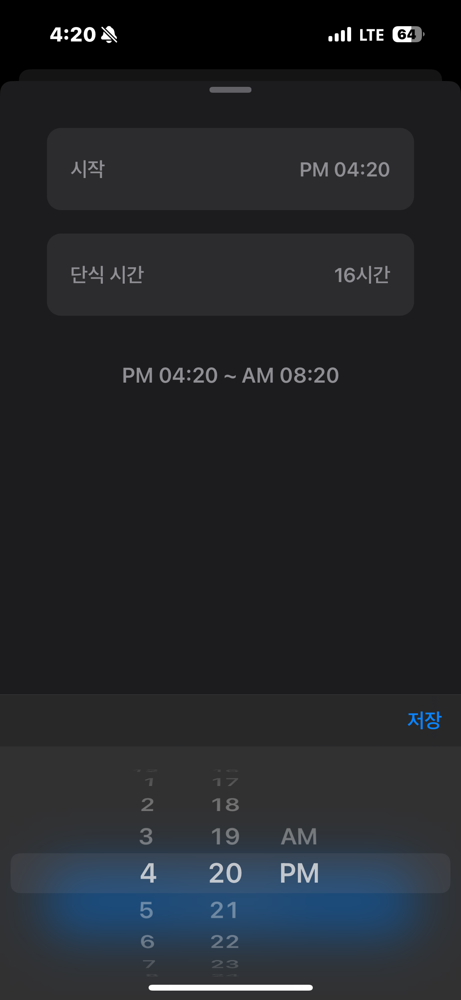
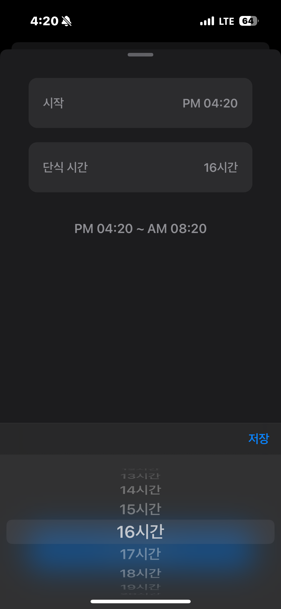
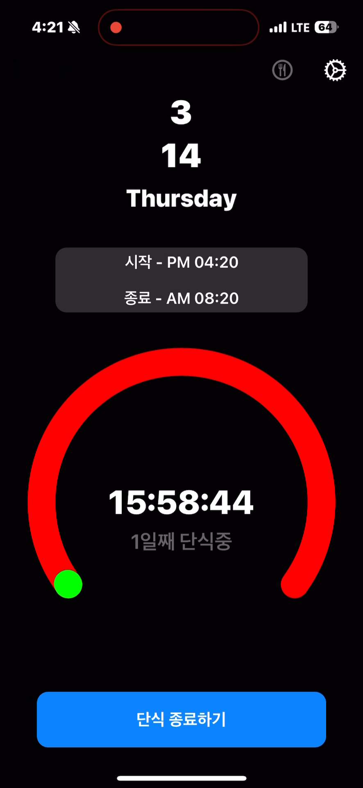

# EightSixteen
간헐적 단식 다이어트에 도움을 주는 앱으로, 단식 시작 시간과 단식 시간을 설정하고 단식 시간을 프로그레스 바와 타이머로 확인하며 시간, 종료 시간에 알림을 받을 수 있는 앱

# 사용 기술
- Swift, UIKit
- RxSwift, RxCocoa, RxDatasources
- SnapKit
- Kingfisher
- Alamofire

# 설계
MVVM 패턴을 채용하였으며, ViewModel의 바인딩에 RxSwift를 이용하였습니다.

# 주요 기능
> 단식 진행 여부에 따른 단식 진행 상태 표시

    
    

> 피커를 활용한 단식 시작 시간과 단식 시간 설정

    
    
    

> 단식 시작, 종료 노티를 받을지 설정할 수 있는 설정 화면

    

> 공공 레시피 API를 활용한 음식 영양소, 레시피 화면

    
    
    

> 음식 리스트 아래로 스크롤 시 API 페이징 구현

    

# 기술적 도전
### MVVM, RxSwift
> MVVM 패턴을 채용하며, 뷰에 대한 데이터를 바인딩 하는데 RxSwift를 이용했습니다. MVVM 구조를 익힐 수 있었고, 리액티브 프로그래밍은 어떤 식으로 생각해며 코드를 작성하고 설계해야 하는지 배웠습니다.

### Coordinator Pattern
> 뷰 컨트롤러간 화면 전환 시 매번 어떤 VC가 다음 VC에 대한 설정 값을 가지고 화면을 이동시키는 책임을 분리하기 위하여 코디네이터 패턴을 적용했습니다.

### Networking
> Alamofire를 통해서 공공 API와 iOS 앱을 연동했습니다. API에 데이터를 요청하고 받아오는 흐름에 대해 배웠습니다. 또 API로 부터 요청을 받아 뷰에 그리는 흐름을 RxSwift를 통해 리액티브하게 처리했습니다.

### RxDataSources
> 설정 화면을 구현할 때 설정 값의 성격에 맞게 섹션과 기능을 나누고 싶었는데, 기본적인 RxCocoa로는 테이블 뷰의 데이터를 성격에 맞게 섹션을 나누기가 어려워 RxDataSources를 사용했습니다.

### Testflight
> iOS 앱을 배포하기 전 내부 테스트를 위해 Apple Developer Program에 가입 후 App Store Connect, Testflight를 이용해 앱을 주변인들에게 배포하였습니다.

### Fastlane
> 개발 후 Testflight에 수동으로 설정하여 배포하는 과정을 Fastlane을 이용하여 자동화하였습니다. 제한적인 cert & sigh 인증 방식이 아니라 여러 개발자가 협업하기에 적절한 Match 방식으로 인증하는 방법을 채택하여 Fastlane을 구성하였습니다.

### XCode Instruments
> ARC의 Strong Capturing으로 인한 Retain Cycle을 확인하고 수정 후 메모리가 정상적으로 동작하는 부분을 Xcode Instruments와 Debugg Session
으로 확인하였습니다.

# 블로그 작성
개발을 진행하며 배운 내용 중 공유하고 싶은 내용을 블로그에 작성하였습니다.

[XCode Instruments로 메모리 릭 확인하기](https://medium.com/peppermint100/xcode-instruments%EB%A1%9C-%EB%A9%94%EB%AA%A8%EB%A6%AC-%EB%A6%AD-%ED%99%95%EC%9D%B8%ED%95%98%EA%B8%B0-a1da64c87466)

[Fastlane으로 TestFlight에 앱 업로드하기](https://medium.com/peppermint100/fastlane%EC%9C%BC%EB%A1%9C-testflight%EC%97%90-%EC%95%B1-%EC%97%85%EB%A1%9C%EB%93%9C%ED%95%98%EA%B8%B0-9220cbe08056)
